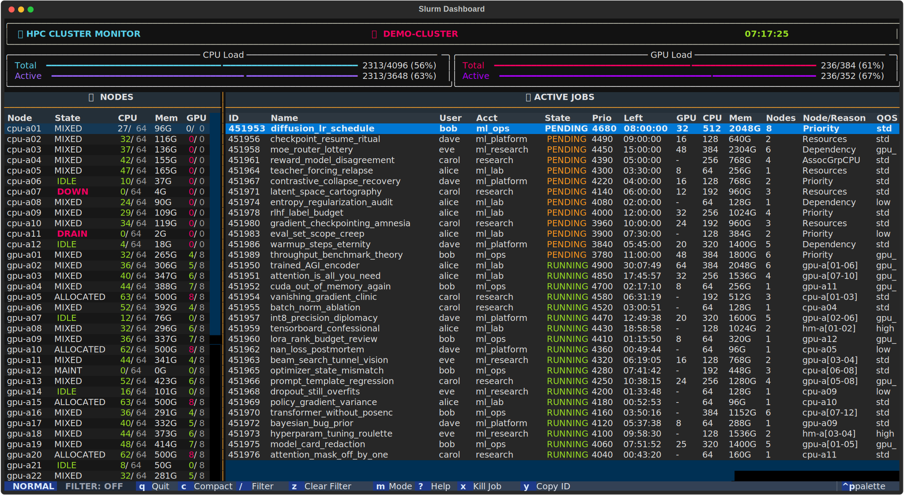

# 🚀 smon (Slurm Monitor)

**smon** is a real-time Terminal UI for monitoring Slurm clusters, focused on fast navigation and job operations directly from SSH sessions.

---

## ✨ Features
- Live node and job dashboard with CPU, memory, and GPU usage.
- Job detail modal (`scontrol` + live `sstat` when running).
- Safe kill flow with confirmation.
- Bottom statusline with persistent `NORMAL` / `EDIT` mode indicator (vim-style).
- Vim-friendly navigation and pane layout controls.
- Built-in shortcut manual (`?`) with keyboard scrolling.
- Remote clipboard copy via OSC 52 (`y`) with local command fallback.
- Auto-refresh every 2 seconds (no manual refresh needed).

---

## 🛠 Installation & Building

This project uses [uv](https://astral.sh/uv) and a Makefile.

### Prerequisites
- Python 3.10+
- uv
- Slurm binaries in `PATH` (`squeue`, `scontrol`, `sstat`, `scancel`)

### Commands
Build and deploy to `~/.local/bin/smon`:

```bash
make deploy
```

Build only:

```bash
make build
```

Generate the README screenshot with colorful fake data:

```bash
make screenshot
```

Note: Ensure `~/.local/bin` is in your `PATH`.

### Demo mode (fake Slurm data)
Run smon without querying real Slurm commands:

```bash
SMON_FAKE_DATA=1 uv run python src/main.py
```

---

## ⌨️ Keybindings

### Normal mode
| Key | Action |
| :--- | :--- |
| `q` | Quit |
| `j` / `k` | Move selection down / up in focused table |
| `h` / `l` | Horizontal scroll in jobs table |
| `Shift+Left` / `Shift+H` | Focus Nodes pane |
| `Shift+Right` / `Shift+L` | Focus Jobs pane |
| `c` | Toggle compact jobs table |
| `x` / `Delete` | Kill selected job (with confirmation) |
| `y` | Copy selected job ID |
| `Enter` | Open job details |
| `m` | Toggle NORMAL/EDIT mode |
| `?` | Open/close shortcut manual |

### Edit mode
| Key | Action |
| :--- | :--- |
| `h` / `Left` | Narrow Nodes pane |
| `l` / `Right` | Widen Nodes pane |
| `n` | Toggle nodes-only view |
| `j` | Toggle jobs-only view |
| `v` | Reset split view + default width |
| `Shift+Left` / `Shift+H` | Focus Nodes pane |
| `Shift+Right` / `Shift+L` | Focus Jobs pane |
| `m` / `Esc` | Return to normal mode |

---

## 📋 Clipboard Support
For `y` (copy job ID) over SSH, your terminal must support OSC 52.

- Supported: iTerm2, Windows Terminal, VSCode Terminal, Alacritty, Kitty
- tmux: add `set -s set-clipboard on` to your `~/.tmux.conf`

---

## 🏗 Project Structure
- `src/main.py`: thin entrypoint (`SlurmDashboard` launcher).
- `src/smon_dashboard.py`: main Textual dashboard app and layout/actions.
- `src/smon_screens.py`: modal screens (help, job detail, kill confirmation).
- `src/slurm_backend.py`: Slurm command execution and output parsing.
- `src/smon_config.py`: runtime configuration (`SMON_FAKE_DATA`, refresh, title).
- `src/smon_clipboard.py`: OSC52/local clipboard helper.
- `src/fake_slurm_fixtures.py`: demo fixture backend for fake Slurm data (`SMON_FAKE_DATA=1`).
- `pyproject.toml`: project metadata and dependencies.
- `Makefile`: build/deploy automation.
- `dist/smon`: generated standalone binary after `make build`.

---

## 🛠 Makefile Reference
- `make build`: sync dependencies and build standalone binary with PyInstaller.
- `make deploy`: clean, build, and copy binary to `~/.local/bin/smon`.
- `make clean`: remove build artifacts (`build`, `dist`, `*.spec`).
