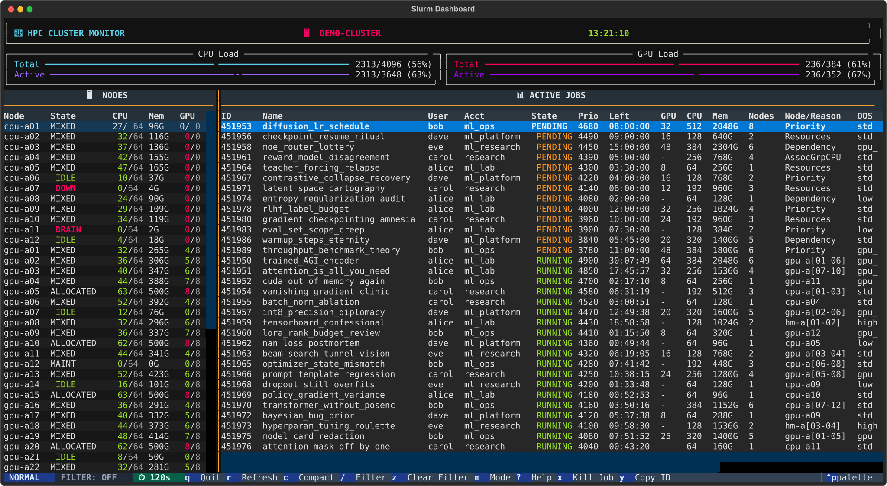
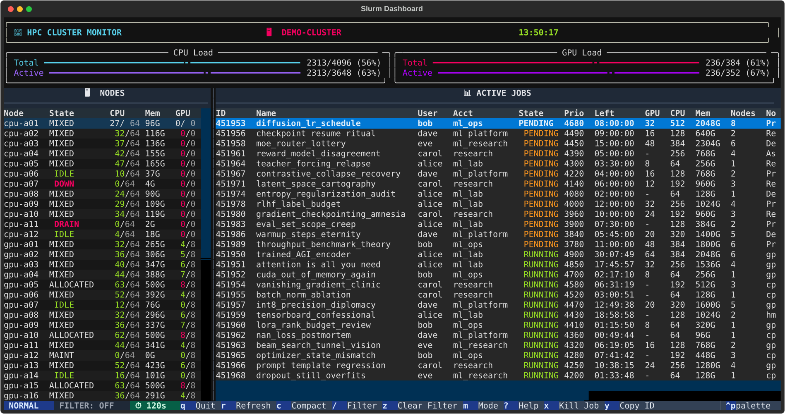
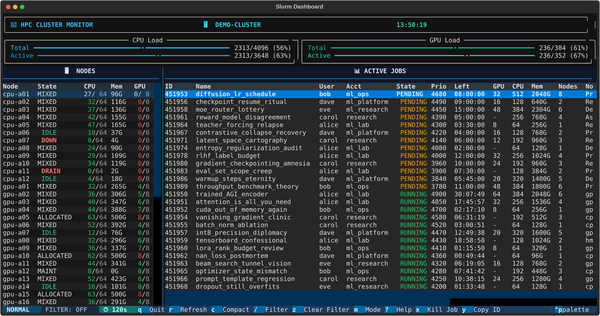
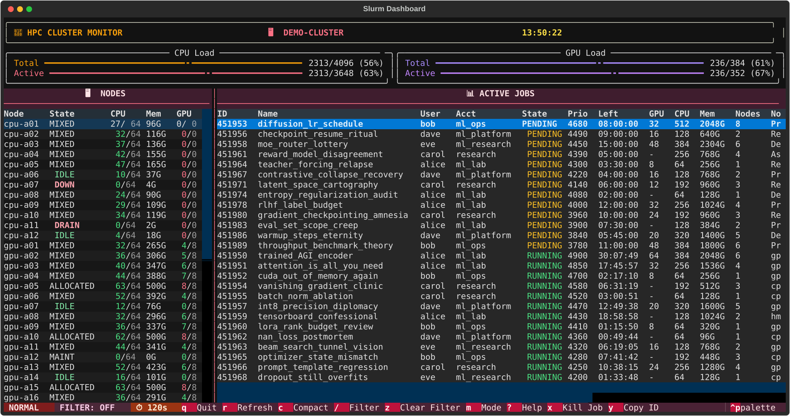
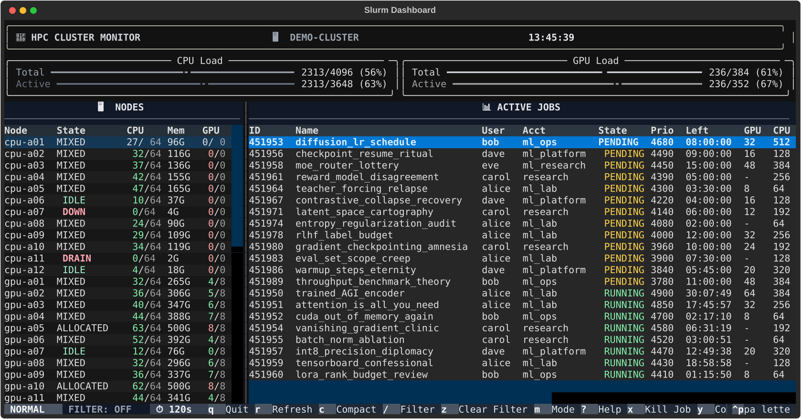

# 🚀 smon (Slurm Monitor)

**smon** is a community-developed real-time Terminal UI for viewing Slurm data, focused on fast navigation and job operations directly from SSH sessions.

## ⚠️ Disclaimer
- **smon is a community user tool, not an official service.**
- It is not the authoritative source of cluster health, incidents, or availability.
- Data shown in smon comes from Slurm CLI output and may be delayed, partial, or unavailable.

---

## ✨ Features
- Live node and job dashboard with CPU, memory, and GPU usage.
- Collapsible My Workload panel with personal GPU usage and per-array task progress.
- Interactive job filtering by user and job-name prefix.
- Job detail modal (`scontrol` + live `sstat` when running).
- Safe kill flow with confirmation.
- Bottom statusline with persistent `NORMAL` / `EDIT` mode indicator (vim-style).
- Vim-friendly navigation and pane layout controls.
- Built-in shortcut manual (`?`) with keyboard scrolling.
- Remote clipboard copy via OSC 52 (`y`) with local command fallback.
- Auto-refresh every 120 seconds (configurable, HPC cluster policy compliant).
- Manual refresh with `r` key anytime.

---

## 🛠 Installation & Building

This project uses [uv](https://astral.sh/uv) and a Makefile.

### Prerequisites
- Python 3.10+
- uv
- Slurm binaries in `PATH` (`squeue`, `scontrol`, `sstat`, `scancel`)

### Commands
Build and deploy to `~/.local/bin/smon`:

```bash
make deploy
```

Build only:

```bash
make build
```

Generate README screenshots (main view + theme gallery) with colorful fake data:

```bash
make screenshot
```

Note: Ensure `~/.local/bin` is in your `PATH`.

### Demo mode (fake Slurm data)
Run smon without querying real Slurm commands:

```bash
SMON_FAKE_DATA=1 uv run python src/main.py
```

---

## ⌨️ Keybindings

### Normal mode
| Key | Action |
| :--- | :--- |
| `q` | Quit |
| `r` | Manual refresh (reload data from Slurm) |
| `j` / `k` | Move selection down / up in focused table |
| `h` / `l` | Horizontal scroll in jobs table |
| `Shift+Left` / `Shift+H` | Focus Nodes pane |
| `Shift+Right` / `Shift+L` | Focus Jobs pane |
| `1` / `2` / `3` | Focus Nodes / Jobs / My Workload |
| `c` | Toggle compact jobs table |
| `w` | Minimize/restore scrollable My Workload panel |
| `/` | Open job filter dialog |
| `z` | Clear all active job filters |
| `x` / `Delete` | Kill selected job (with confirmation) |
| `y` | Copy selected job ID |
| `Enter` | Open job details |
| `m` | Toggle NORMAL/EDIT mode |
| `?` | Open/close shortcut manual |

### Edit mode
| Key | Action |
| :--- | :--- |
| `h` / `Left` | Narrow Nodes pane |
| `l` / `Right` | Widen Nodes pane |
| `n` | Toggle nodes-only view |
| `j` | Toggle jobs-only view |
| `v` | Reset split view + default width |
| `Shift+Left` / `Shift+H` | Focus Nodes pane |
| `Shift+Right` / `Shift+L` | Focus Jobs pane |
| `m` / `Esc` | Return to normal mode |

---

## ⚙️ Configuration

smon can be configured via `~/.config/smon/config.toml`. Copy `config.example.toml` from the repo to get started:

```bash
mkdir -p ~/.config/smon
cp config.example.toml ~/.config/smon/config.toml
```

### Available Options

| Option | Type | Default | Description |
| :--- | :--- | :--- | :--- |
| `refresh_interval` | int | `120` | Seconds between auto-refresh (minimum: 120) |
| `auto_refresh` | bool | `true` | Enable automatic refresh |
| `compact_mode` | bool | `false` | Start in compact job view |
| `default_pane` | string | `"jobs"` | Default focused pane (`"jobs"` or `"nodes"`) |
| `color_scheme` | string | `"default"` | UI color palette (`"default"`, `"ocean"`, `"sunset"`, `"graphite"`) |
| `job_columns` | list | all | Columns to show in full job view |

### Example: Minimal Job Columns

```toml
# Show only essential columns
job_columns = ["id", "user", "state", "gpu", "nodes", "left"]
```

### Example: Color Scheme

```toml
color_scheme = "ocean"
```

### Theme Gallery

The screenshots below are generated by `make screenshot` using fake Slurm data and each built-in `color_scheme` (rendered smaller than the main screenshot for easier side-by-side comparison).

| Default | Ocean |
| :---: | :---: |
|  |  |
| Sunset | Graphite |
|  |  |

### HPC Cluster Policy Compliance

The default 120-second refresh interval complies with HPC cluster policies that discourage high-frequency polling of Slurm commands. Manual refresh (`r` key) is always available for on-demand updates.

---

## 🔎 Filtering Jobs
- Press `/` to open the job filter dialog.
- `User` filter is case-insensitive substring matching.
- `Name prefix` filter matches job names that start with the prefix (case-insensitive).
- If both fields are set, matching uses **AND**.
- Active filters persist across auto-refresh and application restarts until cleared.
- Press `z` for a quick clear-all reset.

---

## 📋 Clipboard Support
For `y` (copy job ID) over SSH, your terminal must support OSC 52.

- Supported: iTerm2, Windows Terminal, VSCode Terminal, Alacritty, Kitty
- tmux: add `set -s set-clipboard on` to your `~/.tmux.conf`

---

## 🏗 Project Structure
- `src/main.py`: thin entrypoint (`SlurmDashboard` launcher).
- `src/smon_dashboard.py`: main Textual dashboard app and layout/actions.
- `src/smon_screens.py`: modal screens (help, job detail, kill confirmation, job filter).
- `src/slurm_backend.py`: Slurm command execution and output parsing.
- `src/smon_config.py`: runtime configuration (TOML loading, refresh, title).
- `src/smon_clipboard.py`: OSC52/local clipboard helper.
- `src/fake_slurm_fixtures.py`: demo fixture backend for fake Slurm data (`SMON_FAKE_DATA=1`).
- `scripts/generate_screenshot.py`: deterministic screenshot generator for README and theme gallery images.
- `config.example.toml`: example configuration file with all options documented.
- `pyproject.toml`: project metadata and dependencies.
- `Makefile`: build/deploy automation.
- `dist/smon`: generated standalone binary after `make build`.

---

## 🛠 Makefile Reference
- `make build`: sync dependencies and build standalone binary with PyInstaller.
- `make deploy`: clean, build, and copy binary to `~/.local/bin/smon`.
- `make clean`: remove build artifacts (`build`, `dist`, `*.spec`).
- `make screenshot`: generate the main README screenshot plus all theme-gallery screenshots.

---

## 🤝 Contributors
- [@RuHae](https://github.com/RuHae)
- [@mauricekraus](https://github.com/mauricekraus)
